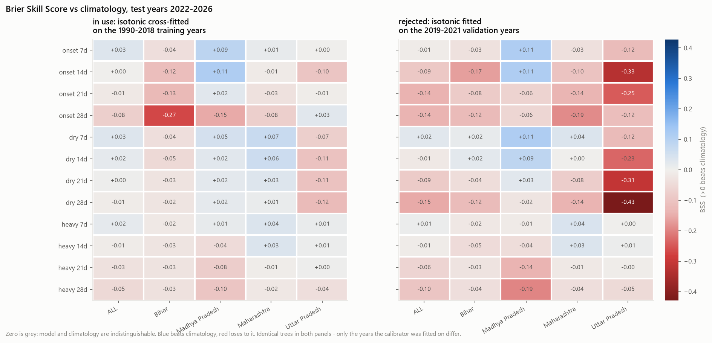
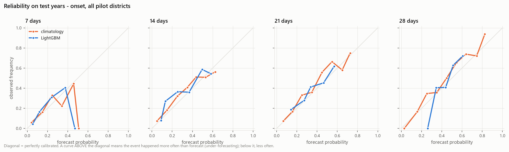
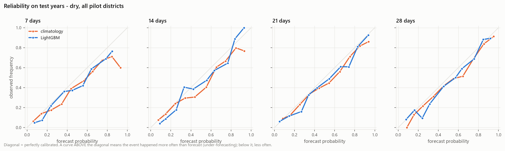
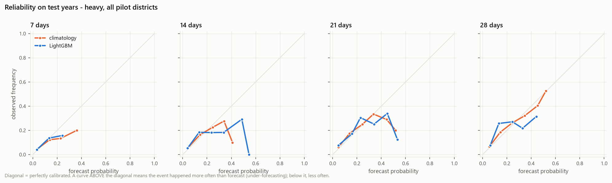
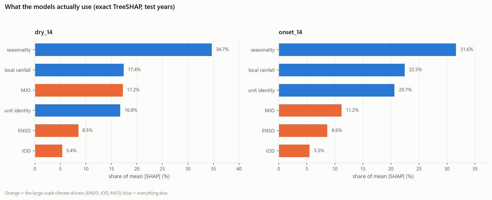

# Baseline report - Phase 3

Pilot districts only (30 sub-district units across 8 districts).
Trained on 1990-2018, early-stopped and isotonic-calibrated on 2019-2021,
scored on **2022-2026** - years neither the model nor the calibrator saw.

## The short version

**6 of 12 target/horizon combinations beat climatology as specified.** Without the isotonic step the same trees beat it on 5 of 12.

Two things are going on, and they pull in opposite directions:

1. **The models rank well.** AUC is 0.62-0.78 everywhere - clearly better than the 0.50 of a coin flip. The model knows which start dates are riskier than others.
2. **The probabilities are miscalibrated on the test years, and the calibration step is what made it worse** - isotonic regression lowered the Brier Skill Score in 4 of the 12 cases.

That combination - good ranking, bad probabilities - is exactly what a negative BSS with a high AUC means. Brier punishes being confidently off; AUC does not notice.

### Why calibrating on the validation years backfired

The first version of this pipeline fitted isotonic regression on 2019-2021 and lost skill in 11 of 12 cases. Those three years are not representative of the base rates on either side of them:

| target | events in train (1990-2018) | in calibration (2019-2021) | in test (2022-2026) | mean forecast on test |
|---|---:|---:|---:|---:|
| dry_7 | 25.7% | 17.0% | 21.4% | 25.6% |
| dry_14 | 36.3% | 22.7% | 31.3% | 35.8% |
| dry_21 | 45.3% | 28.7% | 40.1% | 44.1% |
| dry_28 | 53.5% | 35.8% | 47.7% | 52.0% |
| heavy_7 | 4.5% | 4.9% | 5.1% | 4.5% |
| heavy_14 | 8.7% | 8.5% | 9.7% | 8.3% |
| heavy_21 | 12.4% | 12.1% | 14.0% | 12.3% |
| heavy_28 | 16.3% | 15.8% | 17.9% | 16.2% |
| onset_7 | 11.6% | 17.6% | 13.5% | 11.8% |
| onset_14 | 22.3% | 35.2% | 26.7% | 23.3% |
| onset_21 | 32.6% | 49.9% | 38.6% | 34.8% |
| onset_28 | 42.4% | 60.1% | 50.1% | 43.9% |

Dry spells were far rarer in 2019-2021 than in the training years, so isotonic learned to shrink probabilities downward - and then the test years, which were closer to the long-run rate, came out systematically under-forecast. Onset runs the other way: 2019-2021 had an unusually high onset rate, so onset probabilities were pushed up and the test years are over-forecast. A monotone non-parametric calibrator is flexible enough to lock a three-year base rate in hard.

### Skill per target

| target | horizon | BSS (as specified) | BSS (uncalibrated) | AUC | Brier (model) | Brier (clim) | n | events | trees |
|---|---:|---:|---:|---:|---:|---:|---:|---:|---:|
| dry | 7d | +0.032 | +0.039 | +0.790 | 0.1362 | 0.1407 | 4,140 | 884 | 134 |
| dry | 14d | +0.019 | +0.024 | +0.772 | 0.1752 | 0.1785 | 4,110 | 1,286 | 89 |
| dry | 21d | +0.004 | +0.006 | +0.772 | 0.1894 | 0.1903 | 4,050 | 1,626 | 92 |
| dry | 28d | -0.010 | -0.008 | +0.774 | 0.1945 | 0.1926 | 4,020 | 1,916 | 81 |
| heavy | 7d | +0.020 | +0.012 | +0.753 | 0.0468 | 0.0478 | 4,140 | 212 | 97 |
| heavy | 14d | -0.007 | -0.018 | +0.735 | 0.0842 | 0.0836 | 4,110 | 399 | 81 |
| heavy | 21d | -0.033 | -0.039 | +0.713 | 0.1161 | 0.1124 | 4,050 | 565 | 64 |
| heavy | 28d | -0.053 | -0.062 | +0.688 | 0.1431 | 0.1359 | 4,020 | 721 | 64 |
| onset | 7d | +0.032 | +0.017 | +0.756 | 0.1051 | 0.1085 | 1,432 | 194 | 24 |
| onset | 14d | +0.001 | -0.037 | +0.745 | 0.1727 | 0.1728 | 1,425 | 380 | 16 |
| onset | 21d | -0.014 | -0.082 | +0.709 | 0.2096 | 0.2067 | 1,411 | 545 | 11 |
| onset | 28d | -0.076 | -0.105 | +0.667 | 0.2335 | 0.2171 | 1,404 | 703 | 11 |

BSS is the fraction of climatology's Brier score removed: `+0.10` means 10% better than climatology, `0` means indistinguishable from it, negative means worse. AUC measures ranking only and ignores calibration entirely, which is why a model can have AUC well above 0.5 and still a negative BSS.

## Per state

| target | horizon | Bihar | Madhya Pradesh | Maharashtra | Uttar Pradesh |
|---|---:|---:|---:|---:|---:|
| onset | 7d | -0.039 | +0.090 | +0.014 | +0.002 |
| onset | 14d | -0.116 | +0.112 | -0.013 | -0.099 |
| onset | 21d | -0.127 | +0.025 | -0.030 | -0.006 |
| onset | 28d | -0.270 | -0.151 | -0.077 | +0.025 |
| dry | 7d | -0.038 | +0.049 | +0.068 | -0.074 |
| dry | 14d | -0.053 | +0.025 | +0.061 | -0.106 |
| dry | 21d | -0.028 | +0.022 | +0.032 | -0.106 |
| dry | 28d | -0.024 | +0.017 | +0.012 | -0.122 |
| heavy | 7d | -0.015 | +0.014 | +0.036 | +0.011 |
| heavy | 14d | -0.026 | -0.045 | +0.035 | +0.007 |
| heavy | 21d | -0.028 | -0.079 | -0.006 | +0.005 |
| heavy | 28d | -0.031 | -0.100 | -0.017 | -0.040 |

## Per pilot district

Sample sizes here are small and some are very small, so these are reported with their event counts rather than ranked. A district with fewer than 10 events in the test years is marked -- its score is dominated by which years happened to fall in the split.

| target | horizon | district | BSS | AUC | n | events | |
|---|---:|---|---:|---:|---:|---:|---|
| dry | 7d | Gaya | -0.091 | +0.787 | 138 | 17 |  |
| dry | 7d | Purnia | +0.084 | +0.483 | 138 | 4 | too few events |
| dry | 7d | Indore | +0.082 | +0.780 | 552 | 108 |  |
| dry | 7d | Sehore | +0.011 | +0.847 | 690 | 111 |  |
| dry | 7d | Bid | +0.054 | +0.738 | 1,104 | 295 |  |
| dry | 7d | Latur | +0.095 | +0.758 | 690 | 135 |  |
| dry | 7d | Gorakhpur | -0.088 | +0.693 | 276 | 68 |  |
| dry | 7d | Jhansi | -0.066 | +0.848 | 552 | 146 |  |
| dry | 14d | Gaya | -0.100 | +0.838 | 137 | 25 |  |
| dry | 14d | Purnia | +0.017 | +0.675 | 137 | 11 |  |
| dry | 14d | Indore | +0.083 | +0.757 | 548 | 157 |  |
| dry | 14d | Sehore | -0.043 | +0.812 | 685 | 158 |  |
| dry | 14d | Bid | +0.049 | +0.701 | 1,096 | 431 |  |
| dry | 14d | Latur | +0.084 | +0.717 | 685 | 200 |  |
| dry | 14d | Gorakhpur | -0.076 | +0.730 | 274 | 104 |  |
| dry | 14d | Jhansi | -0.127 | +0.843 | 548 | 200 |  |
| heavy | 7d | Gaya | -0.080 | +0.206 | 138 | 2 | too few events |
| heavy | 7d | Purnia | +0.000 | +0.560 | 138 | 9 | too few events |
| heavy | 7d | Indore | +0.061 | +0.664 | 552 | 24 |  |
| heavy | 7d | Sehore | -0.007 | +0.765 | 690 | 67 |  |
| heavy | 7d | Bid | +0.029 | +0.822 | 1,104 | 42 |  |
| heavy | 7d | Latur | +0.045 | +0.891 | 690 | 31 |  |
| heavy | 7d | Gorakhpur | +0.018 | +0.448 | 276 | 8 | too few events |
| heavy | 7d | Jhansi | +0.009 | +0.660 | 552 | 29 |  |
| heavy | 14d | Gaya | -0.148 | +0.235 | 137 | 3 | too few events |
| heavy | 14d | Purnia | -0.002 | +0.628 | 137 | 17 |  |
| heavy | 14d | Indore | +0.003 | +0.604 | 548 | 52 |  |
| heavy | 14d | Sehore | -0.073 | +0.714 | 685 | 126 |  |
| heavy | 14d | Bid | +0.046 | +0.837 | 1,096 | 68 |  |
| heavy | 14d | Latur | +0.020 | +0.748 | 685 | 52 |  |
| heavy | 14d | Gorakhpur | +0.089 | +0.682 | 274 | 17 |  |
| heavy | 14d | Jhansi | -0.018 | +0.610 | 548 | 64 |  |
| onset | 7d | Gaya | -0.042 | +0.745 | 42 | 6 | too few events |
| onset | 7d | Purnia | -0.035 | +0.600 | 11 | 6 | too few events |
| onset | 7d | Indore | +0.051 | +0.725 | 176 | 27 |  |
| onset | 7d | Sehore | +0.123 | +0.812 | 183 | 36 |  |
| onset | 7d | Bid | +0.042 | +0.738 | 447 | 39 |  |
| onset | 7d | Latur | -0.023 | +0.747 | 245 | 34 |  |
| onset | 7d | Gorakhpur | -0.067 | +0.693 | 119 | 15 |  |
| onset | 7d | Jhansi | +0.039 | +0.796 | 209 | 31 |  |
| onset | 14d | Gaya | -0.134 | +0.678 | 42 | 12 |  |
| onset | 14d | Purnia | -0.069 | +0.688 | 11 | 8 | too few events |
| onset | 14d | Indore | +0.080 | +0.745 | 176 | 59 |  |
| onset | 14d | Sehore | +0.143 | +0.851 | 183 | 70 |  |
| onset | 14d | Bid | -0.015 | +0.703 | 442 | 82 |  |
| onset | 14d | Latur | -0.010 | +0.698 | 243 | 62 |  |
| onset | 14d | Gorakhpur | -0.202 | +0.649 | 119 | 30 |  |
| onset | 14d | Jhansi | -0.037 | +0.760 | 209 | 57 |  |

Every horizon and every slice is in [`outputs/metrics/metrics.csv`](metrics/metrics.csv).

## Reliability

## Do ENSO, IOD and MJO matter?

Exact TreeSHAP from LightGBM's own `pred_contrib`, over the test rows.

### dry_14

ENSO + IOD + MJO together account for **31.1%** of mean |SHAP|.

| group | mean abs SHAP % | gain % |
|---|---:|---:|
| seasonality | 34.7% | 39.1% |
| local rainfall | 17.4% | 13.6% |
| MJO | 17.2% | 15.4% |
| unit identity | 16.8% | 13.3% |
| ENSO | 8.5% | 11.2% |
| IOD | 5.4% | 7.5% |

Of that 31.1%, only 0.9 points come from the `*_age_days` staleness columns, which are near-deterministic functions of the calendar - so the climate share is genuine index values, not a date proxy sneaking in.

Top individual features: `doy_sin` (29.5%), `rmm2` (12.8%), `centroid_lon` (9.4%), `nino34` (5.5%), `doy_cos` (5.2%), `dmi` (5.0%), `season_to_date` (3.9%), `zone_id` (2.7%)

### onset_14

ENSO + IOD + MJO together account for **25.3%** of mean |SHAP|.

| group | mean abs SHAP % | gain % |
|---|---:|---:|
| seasonality | 31.6% | 28.8% |
| local rainfall | 22.5% | 18.2% |
| unit identity | 20.7% | 18.2% |
| MJO | 11.2% | 11.9% |
| ENSO | 8.6% | 13.4% |
| IOD | 5.5% | 9.5% |

Of that 25.3%, only 0.6 points come from the `*_age_days` staleness columns, which are near-deterministic functions of the calendar - so the climate share is genuine index values, not a date proxy sneaking in.

Top individual features: `doy_cos` (28.0%), `centroid_lat` (13.8%), `rain_prev_7_anom` (11.7%), `dmi` (5.5%), `nino34` (5.4%), `centroid_lon` (5.4%), `rmm2` (4.9%), `rmm1` (3.8%)

### The fix: calibrate on the training years, cross-fitted

Instead of fitting the calibrator on the three validation years, fit it on out-of-fold predictions across the 29 training years - five folds, grouped by year so that rows sharing a season cannot leak across the split. The calibrator then sees a representative base rate instead of a three-year accident.

| calibration | mean test BSS | beats climatology | mean validation optimism |
|---|---:|---:|---:|
| isotonic cross-fitted on training years | -0.0071 | 6/12 | +0.0149 |
| Platt cross-fitted on training years | -0.0081 | 5/12 | +0.0212 |
| uncalibrated | -0.0210 | 5/12 | +0.0457 |
| isotonic on validation years | -0.0640 | 2/12 | +0.1900 |

"Validation optimism" is validation BSS minus test BSS: how much better the model looked on the years used to tune it than on unseen years. Fitting the calibrator on the validation years inflated it by **0.19 BSS**; cross-fitting on the training years brings that down to **0.03**, which is what makes a validation score usable for choosing a model at all.

Per target, moving from validation-fitted to cross-fitted isotonic:

| target | horizon | isotonic on validation | isotonic cross-fitted | change |
|---|---:|---:|---:|---:|
| dry | 7d | +0.0243 | +0.0319 | +0.0077 |
| dry | 14d | -0.0141 | +0.0188 | +0.0329 |
| dry | 21d | -0.0860 | +0.0044 | +0.0903 |
| dry | 28d | -0.1529 | -0.0099 | +0.1430 |
| heavy | 7d | +0.0073 | +0.0197 | +0.0124 |
| heavy | 14d | -0.0072 | -0.0072 | -0.0000 |
| heavy | 21d | -0.0611 | -0.0327 | +0.0283 |
| heavy | 28d | -0.0989 | -0.0531 | +0.0457 |
| onset | 7d | -0.0094 | +0.0315 | +0.0410 |
| onset | 14d | -0.0911 | +0.0008 | +0.0919 |
| onset | 21d | -0.1406 | -0.0139 | +0.1267 |
| onset | 28d | -0.1381 | -0.0756 | +0.0625 |

Eleven of twelve improved and none got worse. The biggest gains are at the long horizons, where the three-year base-rate error compounds most.

### But do they earn their keep?

SHAP says what a model *uses*, not whether using it helps out of sample. The only way to answer that is to drop the 18 ENSO/IOD/MJO columns, refit, and compare - three seeds each, because a single fit moves by more than the effect being measured.

| target | variant | BSS (mean of 3 seeds) | sd | AUC |
|---|---|---:|---:|---:|
| dry_14 | with climate | +0.0226 | 0.0059 | 0.7733 |
| dry_14 | without climate | -0.0046 | 0.0049 | 0.7358 |
| onset_14 | with climate | -0.0465 | 0.0065 | 0.7499 |
| onset_14 | without climate | -0.0152 | 0.0053 | 0.7542 |

- For `dry_14`, the climate drivers **help**: +0.0272 BSS (+0.0374 AUC).
- For `onset_14`, the climate drivers **hurt**: -0.0313 BSS (-0.0042 AUC).

So the honest answer is **it depends on the target**. Dry spells have a real large-scale signal - MJO in particular, with `rmm2` the single biggest climate feature. Onset does not: the climate columns make it measurably worse, which is what overfitting looks like when 18 extra columns meet a target with only ~9.5k training rows.

## Caveats

- **The calibrator is fitted on the same rows that chose the tree count.** Early stopping and isotonic calibration both use 2019-2021, so calibration on those years is optimistic. The test years are unaffected.
- **Three validation years is very little.** Early stopping on ~700 onset rows is noisy, which is why several onset models stop after a handful of trees.
- **`onset_h` is NaN once onset has occurred**, so onset slices are much smaller than dry/heavy ones and are concentrated in the pre-onset part of the season.
- **Purnia's onset labels are known to be wrong.** The default onset rule fires around 22 May there against an official normal of the third week of June, so Purnia's onset scores measure the rule, not the weather.
- Only 8 pilot districts are in scope. Nothing here has been checked against the other 193 districts.
