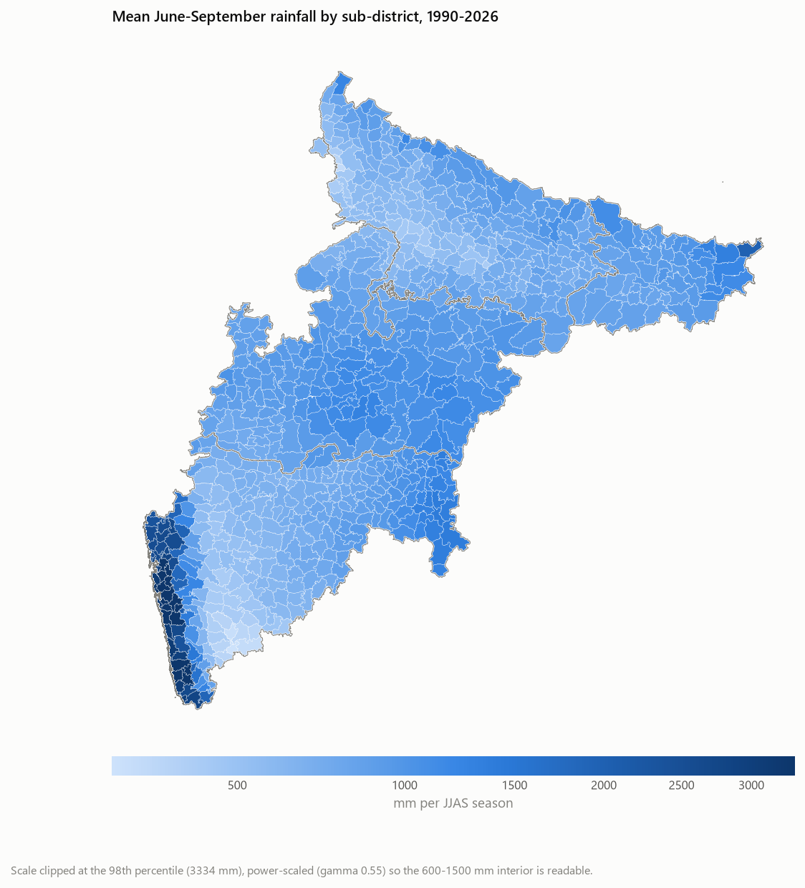
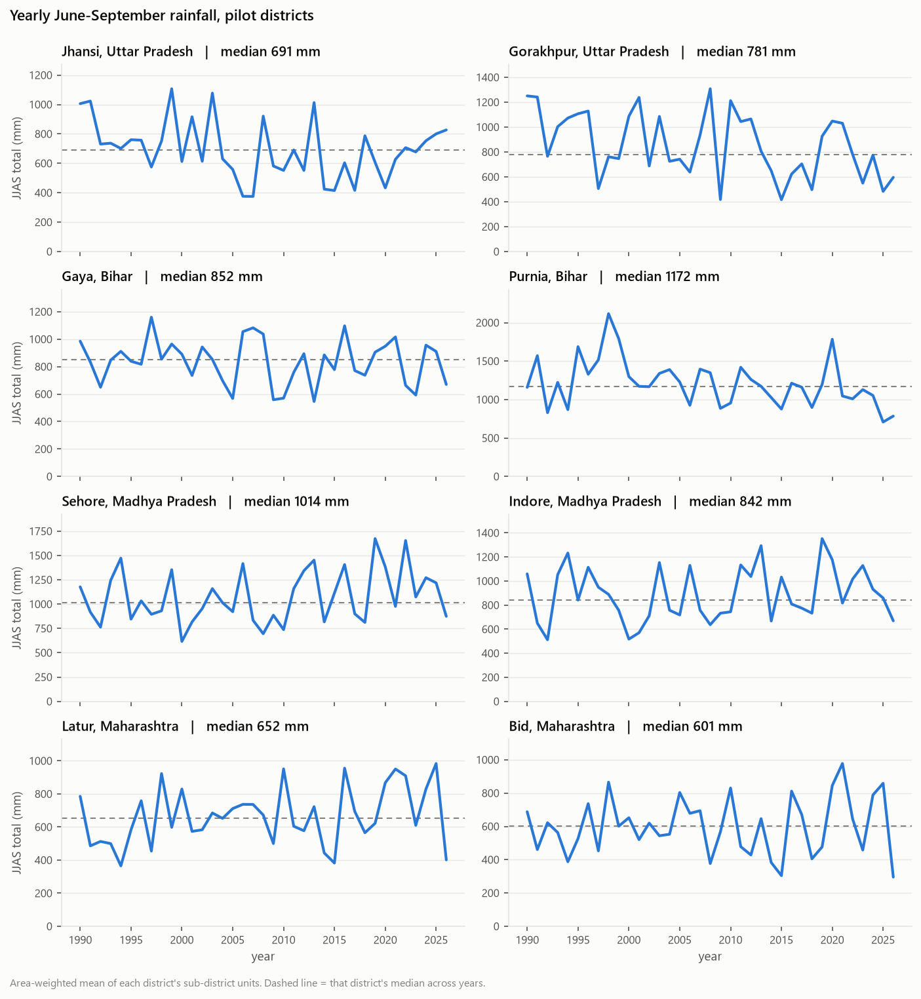

# Phase 1 data-quality report

Generated by `python -m src.data_quality` on 2026-09-26.
Rainfall record **1990-2026**, 739 sub-district units across 5 regions.

Splits (no leakage): train `1990-2018`, validate `2019-2021`, test `2022-2026`. Nothing in this report is fitted; the
training-only climatology is computed in the modelling phase.

## Coverage and missing days

- Units: **739**
- Days per unit: **13,418**
- Units with at least one missing day: **0**
- Units with no observed grid cell at all: **0**
- Units smaller than one grid cell (`small_unit`): **135**
- Units with a placeholder GADM name: **25**

No unit has a missing day.

## Mean June-September rainfall

### Per-state mean JJAS rainfall

| state | units | mean mm | driest unit | wettest unit |
|---|---:|---:|---:|---:|
| Maharashtra | 305 | 1226 | 364 | 4472 |
| Bihar | 53 | 956 | 776 | 2004 |
| Madhya Pradesh | 166 | 941 | 571 | 1299 |
| Uttar Pradesh | 214 | 713 | 372 | 1240 |
| NCT of Delhi | 1 | 529 | 529 | 529 |

## Pilot districts

| state | district | median JJAS mm | min | max | years |
|---|---|---:|---:|---:|---:|
| Bihar | Gaya | 852 | 546 | 1160 | 37 |
| Bihar | Purnia | 1172 | 707 | 2117 | 37 |
| Madhya Pradesh | Indore | 842 | 512 | 1353 | 37 |
| Madhya Pradesh | Sehore | 1014 | 616 | 1674 | 37 |
| Maharashtra | Bid | 601 | 295 | 978 | 37 |
| Maharashtra | Latur | 652 | 365 | 984 | 37 |
| Uttar Pradesh | Gorakhpur | 781 | 417 | 1308 | 37 |
| Uttar Pradesh | Jhansi | 691 | 375 | 1107 | 37 |

## Climate index coverage and staleness

Monthly indices are forward-filled to daily, so each carries an
`age_days` column. The ages below are why that matters: a plain
forward-fill would present a months-old ENSO or IOD value as today's.

| index | first | last | missing days | age today |
|---|---|---|---:|---:|
| ONI | 1990-01-01 | 2026-09-26 | 0 | 87 d |
| Nino3.4 | 1990-01-01 | 2026-09-26 | 0 | 117 d |
| IOD DMI | 1990-01-01 | 2026-09-26 | 0 | 148 d |
| MJO RMM1 | 1990-01-01 | 2026-09-26 | 0 | 4 d |
| MJO RMM2 | 1990-01-01 | 2026-09-26 | 0 | 4 d |
| MJO amplitude | 1990-01-01 | 2026-09-26 | 0 | 4 d |

## Known limitations

- **GADM level 3 is not uniformly sub-district.** Bihar has 53 level-3 polygons for 38 districts and Delhi has 1, so Gaya and Purnia have no sub-district resolution until block polygons are supplied.
- **25 units have placeholder GADM names** (`n.a. ( 1681 )`). They are real polygons and are kept, but must never be named in an advisory.
- **149 of 201 districts have no sourced NARP zone** and fall back to the documented default onset rule. See `config/zones_narp.csv`.
- **The PSL IOD DMI lags several months.** See the staleness table above.

Sources for every dataset: [`data/SOURCES.md`](../data/SOURCES.md).
